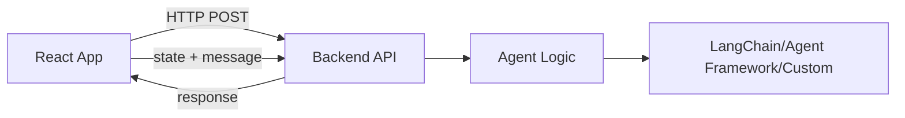

# agent-state-bridge

**Full-stack bridge for sharing app state between frontend and AI agents.** Includes React hooks/components (npm) and Python backend utilities (PyPI) for FastAPI, Flask, and Django.

> 🚀 Build AI-powered apps with seamless state synchronization. **New in v0.2.0**: `{messages, actions, context}` model separates CRUD operations from state, ready for RAG integration.

---

## 📦 Packages

This monorepo contains two complementary packages:

| Package                | Platform | Description                                 |
| ---------------------- | -------- | ------------------------------------------- |
| **agent-state-bridge** | npm      | React hooks and UI components for frontend  |
| **agent-state-bridge** | PyPI     | Python utilities for FastAPI, Flask, Django |

---

## 🎯 Frontend (React/TypeScript)

### Installation

```bash
npm install agent-state-bridge
```

### Quick Start

#### 1. Hook for state management

```tsx
import { useAgentChat } from "agent-state-bridge";

const { messages, sendMessage, loading, error } = useAgentChat({
  endpoint: "http://localhost:8000/chat",
  getContext: () => myAppState, // App state + RAG data
  getActions: () => recentActions, // Optional: recent CRUD operations
  onActionsReceived: (actions) => executeActions(actions), // Optional: handle agent actions
});
```

**New in v0.2.0:** Separates concerns for better scalability:

- `getContext`: Application state and RAG context
- `getActions`: Recent state mutations (CRUD operations)
- `onActionsReceived`: Execute actions returned by the agent

#### 2. Ready-to-use chat component

```tsx
import { AgentChatSidebar } from "agent-state-bridge";

<AgentChatSidebar
  messages={messages}
  onSend={sendMessage}
  loading={loading}
  error={error}
  open={open}
  onClose={() => setOpen(false)}
/>;
```

### Features

✅ **State-agnostic**: Works with Zustand, Redux, useState, useContext, etc.  
✅ **UI included**: Pre-built chat component with markdown support  
✅ **Customizable**: Use hooks only or customize the UI  
✅ **TypeScript**: Fully typed

📖 [Full Frontend Documentation →](./src/)

---

## 🐍 Backend (Python)

### Installation

```bash
# For FastAPI (recommended)
pip install agent-state-bridge[fastapi]

# For Flask
pip install agent-state-bridge[flask]

# For Django
pip install agent-state-bridge[django]
```

### Quick Start

#### FastAPI

```python
from fastapi import FastAPI
from agent_state_bridge.fastapi import create_agent_router
from agent_state_bridge.models import AgentResponse, Message, Action

async def my_agent(messages: list[Message], actions: list[Action], context: dict) -> AgentResponse:
    """
    New v0.2.0 model: {messages, actions, context}
    - messages: Conversation history
    - actions: Recent CRUD operations (post, put, delete)
    - context: App state + RAG data
    """
    cart_items = context.get("cart", {}).get("items", [])
    last_msg = messages[-1].content if messages else ""

    response_text = f"You have {len(cart_items)} items. You said: {last_msg}"

    # Optionally return actions for the frontend to execute
    return AgentResponse(
        response=response_text,
        actions=[Action(type="post", payload={"product": "suggested_item"})],  # Optional
        context={"updated": "data"}  # Optional
    )

app = FastAPI()
router = create_agent_router(my_agent, tags=["agent"])
app.include_router(router)
```

**Why this model?**

- ✅ Separates state mutations (actions) from context
- ✅ Ready for RAG: Add vector search results to context
- ✅ Bidirectional actions: Agent can return actions for frontend to execute
- ✅ Scalable: Easy to add query agents and semantic search

#### Flask

```python
from flask import Flask
from agent_state_bridge.flask import create_agent_blueprint

def my_agent(message: str, state: dict) -> str:
    return f"Processed: {message}"

app = Flask(__name__)
bp = create_agent_blueprint(my_agent)
app.register_blueprint(bp)
```

#### Django REST Framework

```python
from agent_state_bridge.django import agent_api_view

@agent_api_view
def my_agent(message: str, state: dict) -> str:
    return f"Processed: {message}"
```

### Agent Framework Support

✅ **LangChain**: Full async support  
✅ **Microsoft Agent Framework**: Azure AI integration  
✅ **CrewAI**: Multi-agent orchestration  
✅ **Custom agents**: Bring your own logic

📖 [Full Backend Documentation →](./python/)  
📁 [Examples with LangChain, Agent Framework, etc. →](./python/examples/)

---

## 🚀 Complete Example

```tsx
import React, { useState } from "react";
import { useAgentChat, AgentChatSidebar } from "agent-state-bridge";
import { useStore } from "./store"; // tu store Zustand

export function MyChat() {
  const [open, setOpen] = useState(false);
  const cart = useStore((s) => s.cart);
  const { messages, sendMessage, loading, error } = useAgentChat({
    endpoint: "http://localhost:8000/chat",
    getState: () => ({ cart }),
  });
  return (
    <>
      <button onClick={() => setOpen(true)}>Open Chat</button>
      <AgentChatSidebar
        messages={messages}
        onSend={sendMessage}
        loading={loading}
        error={error}
        open={open}
        onClose={() => setOpen(false)}
        title="Shopping Assistant"
      />
    </>
  );
}
```

---

## 🚀 Complete Example

### Frontend (React)

```tsx
import React, { useState } from "react";
import { useAgentChat, AgentChatSidebar } from "agent-state-bridge";
import { useStore } from "./store"; // Zustand, Redux, or any state manager

export function MyChat() {
  const [open, setOpen] = useState(false);
  const cart = useStore((s) => s.cart);

  const { messages, sendMessage, loading, error } = useAgentChat({
    endpoint: "http://localhost:8000/chat",
    getState: () => ({ cart }),
  });

  return (
    <>
      <button onClick={() => setOpen(true)}>Open Chat</button>
      <AgentChatSidebar
        messages={messages}
        onSend={sendMessage}
        loading={loading}
        error={error}
        open={open}
        onClose={() => setOpen(false)}
        title="Shopping Assistant"
      />
    </>
  );
}
```

### Backend (Python + FastAPI + LangChain)

```python
from fastapi import FastAPI
from agent_state_bridge.fastapi import create_agent_router
from agent_state_bridge.models import AgentResponse, Message, Action
from langchain_openai import ChatOpenAI
from langchain.schema import HumanMessage, SystemMessage, AIMessage

llm = ChatOpenAI(model="gpt-4o-mini")

async def langchain_agent(messages: list[Message], actions: list[Action], context: dict) -> AgentResponse:
    cart_items = context.get("cart", {}).get("items", [])
    products = context.get("products", [])

    # Build context with cart and products
    context_text = f"Cart: {len(cart_items)} items. Available products: {len(products)}"

    # Convert to LangChain messages
    lc_messages = [SystemMessage(content=f"You are a shopping assistant. {context_text}")]
    for msg in messages:
        if msg.role == "user":
            lc_messages.append(HumanMessage(content=msg.content))
        elif msg.role == "assistant":
            lc_messages.append(AIMessage(content=msg.content))

    response = await llm.ainvoke(lc_messages)

    # Return response with optional actions
    return AgentResponse(
        response=response.content,
        actions=None,  # Could return actions for frontend to execute
        context=None   # Could return updated context
    )

app = FastAPI()
router = create_agent_router(langchain_agent, tags=["agent"])
app.include_router(router)
```

---

## 📚 API Reference

### Frontend (npm)

#### `useAgentChat(options)`

**Options:**

- `endpoint`: string (default: "/chat") - Backend endpoint URL
- `getContext`: () => any (required) - Function returning current app state and RAG data
- `getActions`: () => Action[] (optional) - Function returning recent CRUD operations
- `onActionsReceived`: (actions: Action[]) => void (optional) - Handle actions from agent
- `onContextUpdated`: (context: any) => void (optional) - Handle context updates
- `initialMessages`: Message[] (optional) - Initial chat messages

**Returns:**

- `messages`: Message[] - Chat message history
- `sendMessage`: (msg: string) => Promise<void> - Send message to agent
- `loading`: boolean - Request in progress
- `error`: string | null - Error message if any

#### `<AgentChatSidebar>`

**Props:**

- `messages`, `onSend`, `loading`, `error`, `open`, `onClose` (required)
- `title`, `placeholder`, `sendLabel`, `className`, `style` (optional)

### Backend (PyPI)

#### FastAPI

- `create_agent_router(handler, prefix="", tags=[])` - Create router with `/chat` endpoint
  - `handler`: async function with signature `(messages, actions, context) -> AgentResponse`
- `AgentBridge` - Class-based approach with decorators
- **Models**: `AgentRequest`, `AgentResponse`, `Message`, `Action`

#### Flask

- `create_agent_blueprint(handler, name="agent", url_prefix="")` - Create blueprint
- `@agent_route` - Decorator for route handlers

#### Django

- `@agent_api_view` - Decorator for function-based views
- `AgentAPIView` - Base class for class-based views

---

## 🏗️ Architecture



**Key principles:**

- Frontend is the source of truth for state
- Backend is stateless (no session storage)
- **Separation of concerns**: Actions (CRUD) vs Context (state + RAG)
- Messages, actions, and context sent with every request
- Agent can return actions for frontend to execute
- Ready for RAG: Add vector search results to context
- Works with any AI framework

📖 [Architecture Documentation →](./ARQUITECTURA_ESTADO.md)

---

## 🤝 Contributing

Contributions are welcome! Please feel free to submit a Pull Request.

## 📄 License

MIT License - see [LICENSE](./LICENSE) for details

---

## 🔗 Links

- **npm package**: [npmjs.com/package/agent-state-bridge](https://www.npmjs.com/package/agent-state-bridge)
- **PyPI package**: [pypi.org/project/agent-state-bridge](https://pypi.org/project/agent-state-bridge)
- **GitHub**: [github.com/SergioCantera/agent-state-bridge](https://github.com/SergioCantera/agent-state-bridge)
- **Issues**: [github.com/SergioCantera/agent-state-bridge/issues](https://github.com/SergioCantera/agent-state-bridge/issues)

---

**Made with ❤️ for the AI development community**
